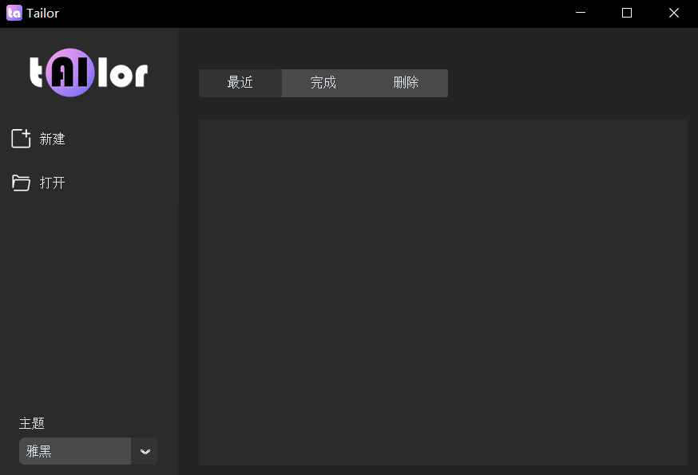

<div align="center">
  

  <h1>Tailor</h1>

  <p>
     Tailor is an amazing video editing magic tool! Its face and voice clipping are extremely precise. The face recognition can lock the character image, and the voice capture and clipping are uniquely charming. In terms of video generation, the oral broadcast generation endows the image with a soul, the subtitle generation is accurately fitted, the color generation makes black and white come alive, and the audio generation creates unlimited possibilities. In terms of optimization, the background replacement is like entering a fantasy world, and the fluency and clarity are also excellent. Tailor is not only a software, but also the key to creativity and wonderfulness. Both professionals and ordinary enthusiasts can make their works shine through it. Come and experience the shock and surprise it brings!
  </p>
<div>
  <strong>
  <samp>

[简体中文](README.md) · [English](README.en.md)

  </samp>
  </strong>
  </div>
</div>

# Content 

<details>
  <summary>Click me to Open/Close the directory listing</summary>

- [Introductions](#introductions)
- [Features](#features)
- [Installation and Running](#installation)
- [Getting Started](#getting-started)
- [Changelog](#changelog)
- [Business](#business)
- [Donators](#donators)
- [Sponsors](#sponsors)
- [Support](#support)
- [Issue](#issue)
- [Special Thanks](#special-thanks)
- [License](#license)

</details>


<a id="introductions"></a>
# Introductions

Tailor is a tool for intelligent video cropping, video generation, and video optimization. Currently, the project covers three major categories of video processing directions, including video editing, video generation, and video optimization, with a total of 10 methods. Tailor is easy to use, allowing users to perform video processing tasks with the most advanced artificial intelligence simply by clicking the mouse, saving time and effort. If users install the installed version of Tailor, all environment configurations can be skipped, making it particularly user-friendly.
## Tailor Interface
### Home  

### Work


<a id="features"></a>
# Features
Tailor includes three major video processing directions such as video editing, video generation and video optimization, with a total of 10 methods. The following will be introduced in turn:

### VIDEO CUT
##### VIDEO CUT FACE
Tailor has amazing face recognition technology, which can automatically capture every wonderful face moment from the video. With just a light click, you can select the face you are concerned about, and Tailor will automatically crop out the relevant video for you like magic, making your protagonist shine all the time!

##### VIDEO CUT AUDIO
Tailor can also intelligently recognize the voice content in the video and display it clearly. You can select the interested voice part according to your own needs, and Tailor will accurately crop out the content you want, making your video more exciting.

### VIDEO GENERATE
##### VIDEO GENERATE BROADCAST
Just upload an image with a human face, select your favorite voice timbre, input the text content you want to generate, and Tailor can instantly generate a corresponding audible video with the voice lip shape for you. Let your creativity be easily realized and create a unique video work! 

##### VIDEO GENERATE CAPTIONS
By intelligently recognizing the audio and video content, Tailor can automatically convert it into text and provide a variety of fonts and colors for you to choose. The subtitle will be perfectly synchronized with the video, making your video more understandable and attractive.

##### VIDEO GENERATE COLOR
Tailor has a one-click black and white video coloring function, which can make those old black and white videos instantly glow with gorgeous colors. It's like going back in time and bringing the classics back to life!

##### VIDEO GENERATE AUDIO
This function can give life to static images and text and turn them into vivid videos. The static image will become the image part of the video, and the text will become the voice part of the video through text-to-speech technology, allowing your creativity to extend infinitely.

##### VIDEO GENERATE LANGUAGE
Tailor has an amazing language replacement ability! It seems to be a magical language magician, which can instantly convert the voice in the video into the language you want. Let your video instantly have an international charm, be able to cross the language barrier, have the closest communication with audiences all over the world, and bring endless surprises and possibilities!


### VIDEO OPTIMIZE
##### VIDEO OPTIMIZE BACKGROUND
Tailor can intelligently recognize the characters in the foreground and separate them from the background. You can easily change the background image to create various fantasy scenes and make your video more fascinating.

##### VIDEO_OPTIMIZE_FLUENCY
Tailor uses advanced techniques to effectively improve the smoothness of the video. Make the originally stuck and frame-skipping video become smooth and silky, just like flowing clouds and flowing water, bringing the ultimate viewing experience to the audience.

##### VIDEO_OPTIMIZE_RESOLUTION
For videos with lower clarity, Tailor can improve the clarity. Say goodbye to "mosaic" and make your video picture clearer and sharper, and the details are undoubtedly revealed.

<a id="installation"></a>
# Installation and Running
Tailor offers two usage modes: User Mode and Developer Mode.  
User Mode allows users to directly install the executable file and set up Tailor on their Windows system. This method is quick and convenient, and is our recommended way of using Tailor.   
For Developer Mode, users need to download the code, configure the corresponding Python environment, initialize the environment required for Tailor's startup, and then run main.py to start Tailor.

## User Mode
This method is very simple to use. Just[download the Tailor release version](https://github.com/FutureUniant/Tailor/releases), double-click to install tailor.exe, and you're ready to go.
Note: Currently, this is only supported for Windows users.

## Developer Mode
### Preconditions / Prerequisites
* Python 3.x (Recommended Python 3.10)
* Necessary Python libraries (some important Python libraries are listed in the `requirements.txt` file, while other libraries can be installed based on your needs.)

### Development Steps
1. Clone this project   
```bash
git https://github.com/FutureUniant/Tailor.git  
cd Tailor
```

2. (Optional) If you expect Tailor to use GPU acceleration, ensure that CUDA and cuDNN are installed correctly.

3. Install Python dependencies
```bash
pip install -r requirements.txt
```

4. Install FFmpeg and ImageMagick  
   1. Install FFMPEG  
      1. Download the [FFmpeg-6.1.1 version](https://www.gyan.dev/ffmpeg/builds/packages/ffmpeg-6.1.1-essentials_build.7z) from the FFmpeg official website  
      2. Unzip the downloaded `.7z` archive into the `extensions` folder under the Tailor root directory.  
      Note: Please keep the name of the extracted FFmpeg folder as `ffmpeg-6.1.1-essentials_build`.
      
   2. Install ImageMagic  
      1. Download the [ImageMagic-7.1.1-29 version](https://imagemagick.org/archive/binaries/ImageMagick-7.1.1-29-portable-Q16-x64.zip)  from the ImageMagic official website  
      2. Unzip the downloaded `.zip` archive into the `extensions` folder under the Tailor root directory.  
      Note: Please keep the name of the extracted ImageMagic folder as `ImageMagick-7.1.1-29-portable-Q16-x64`.

5. Run Tailor  
```bash
python main.py
```

<a id="getting-started"></a>
# Getting Started
1. Open/Create a Tailor Project:
   1. Click the `New` button on the left side of the `Home`, fill in the `Project Name` and `Project Path`, and you can create a new Tailor project;
   2. Click the `Open` button on the left side of the `Home` and directly select the Tailor project location;
   3. Double-click the displayed Tailor project on the right side of the `Home`;
   4. Right-click on the displayed Tailor project on the right side of the `Home` and then click `Open`;
   5. If you installed Tailor using the installer, you can directly double-click the .tailor file to open the project.
2. Video Import
Select `File - Import` to import videos for processing.
Note: Some video generation features do not require importing videos.
Video Processing
3. Select the corresponding video processing method and follow the usage instructions to use it.


<a id="changelog"></a>
# Changelog
* 2024/05/31: The first version of Tailor is officially launched!
* 2024/07/23: 
1. Support voice driven broadcast generate function;  
2. Added a model checking mechanism to avoid model damage caused by network issues that require manual repair;  
3. Fix interface switching bug;  
4. Fix bugs in video multi process processing.  

<a id="business"></a>
# Business
If you need additional commercial cooperation, please contact us at: `mongodb1994@qq.com`。

<a id="donators"></a>
# Donators

<a id="sponsors"></a>
# Sponsors

<a id="support"></a>
# Support  
If you find this project helpful and would like to support its ongoing development and maintenance, you can donate in the following ways.

| WeChat                                                                     | Alipay                                                                  |
|----------------------------------------------------------------------------|-------------------------------------------------------------------------|
|  |  |


<a id="issue"></a>
# Issue
If you encounter any problems during usage, or have any suggestions and feedback, please contact us through GitHub's Issue system, or directly send an email to: `mongodb1994@qq.com`。


<a id="special-thanks"></a>
# Special Thanks
- [whisper](https://github.com/openai/whisper)
- [DDColor](https://github.com/piddnad/DDColor)
- [EmotiVoice](https://github.com/netease-youdao/EmotiVoice)
- [facenet-pytorch](https://github.com/timesler/facenet-pytorch)
- [MODNet](https://github.com/ZHKKKe/MODNet)
- [cv_raft_video-frame-interpolation](https://modelscope.cn/models/iic/cv_raft_video-frame-interpolation/summary)
- [cv_rrdb_image-super-resolution_x2](https://modelscope.cn/models/bubbliiiing/cv_rrdb_image-super-resolution_x2/summary)
- [SadTalker](https://github.com/OpenTalker/SadTalker)

<a id="license"></a>
# License
[Apache-2.0 license](LICENSE)
